# Arch Linux Installation Guide

### Get the Image off of the Arch Linux Wiki's Download page

 - Select a United States ISO

 - I selected the MIT ISO - archlinux-2023.10.14-x86_64.iso

Ran windows command – 

```
certutil -hashfile C:\Users\Iantb\OneDrive\Desktop\archlinux-2023.10.14-x86_64.iso SHA256
```
Compared sha256 checksum - 292269ba9bf8335b6a885921a00d311cdc1dcbe9a1375f297f7f3ecfe31c36a7

- Put it on VM
- Created new vm on workstation pro.
- Selected typical download with 20 GB of memory and 4 GB of RAM.
- Put it in UEFI mode
- Open up Arch Line file folder
- Edit .vmx file with note pad or VSC
	-	Add in after line 1 as line 2: firmware=“efi”

After powering on the VM, and selecting EFI mode, it should look like this:

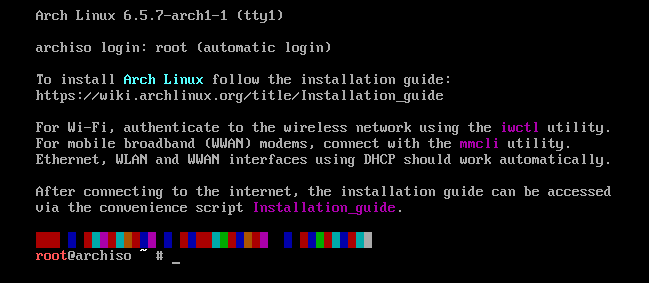

Refer to the Arch Linux Installation Guide
1.5 Set The console Key Board Link
	
```	
	# ls /usr/share/kbd/keymaps/**/*.map.gz

	# loadkeys de-latin1

	# setfont ter-132b
```

No Need to chanage keyboard layout.


### 1.6 Verify the boot mode

Should be in UEFI mode and not the bios.

```
# cat /sys/firmware/efi/fw_platform_size
```
If a file is not returned, you are in the bios.
The size refers to whether the image is a 32 or 64 bit system.

Example:

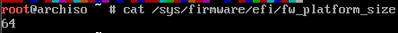

### 1.7 Connect to the internet

```
# ip link

# ping archlinux.org
```
Example:
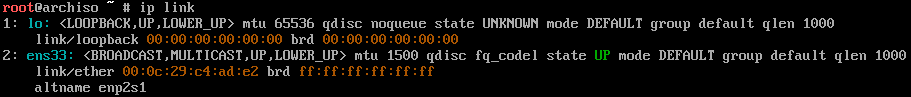

Example:

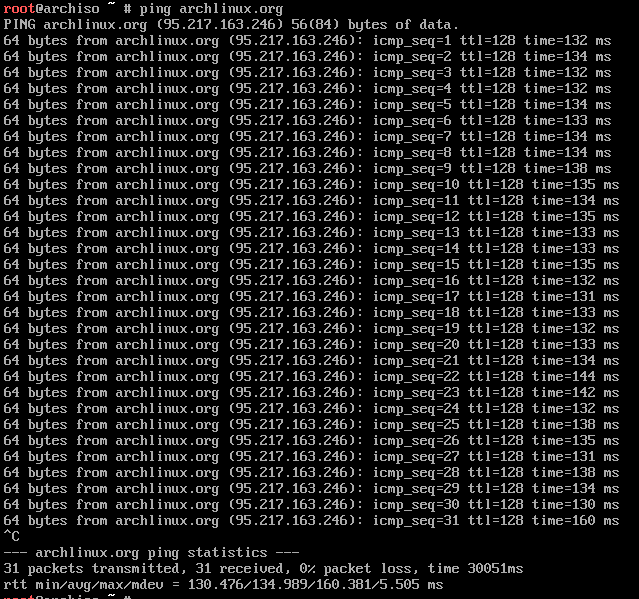

### 1.8 Update the system clock

```
# timedatectl
```
Example:
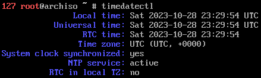

### 1.9 Partition the disks

```
# fdisk -l

# fdisk /dev/sda

m

p

n

p (default)

1

2048 (default)

+500M

p

n

p (default)

2

(default)

(default)

p

w
```
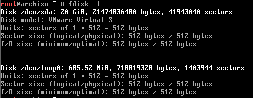

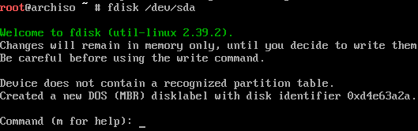

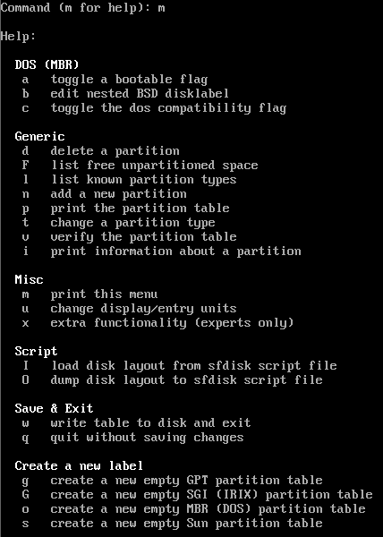

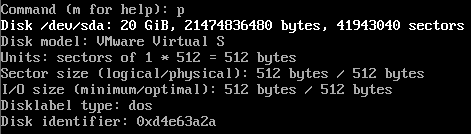

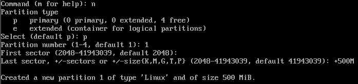

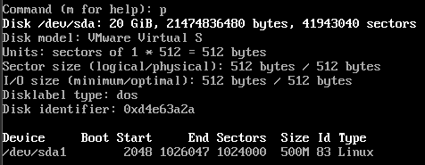

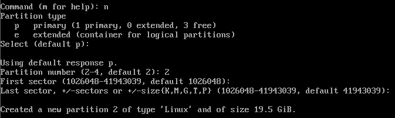

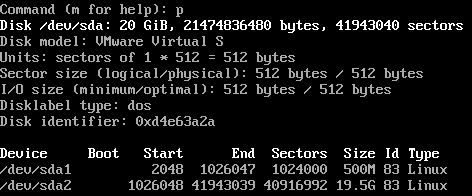

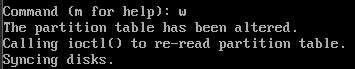

### 1.10 Format the partitions


```
# lsblk -f

# mkfs.ext4 /dev/sda2

# mkfs.fat -F 32 /dev/sda1

#lsblk -f
```

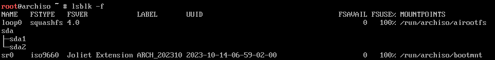

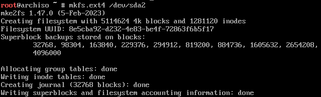

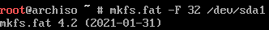

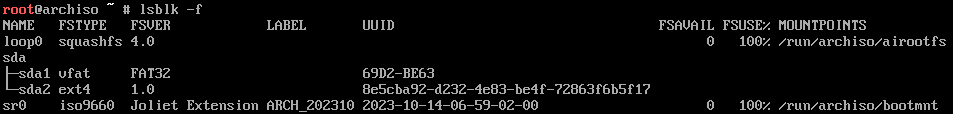


### 1.11 Mount the file systems

```
# findmnt

# findmnt /dev/sda1

# mount /dev/sda2 /mnt

# findmnt /dev/sda2

# mount --mkdir /dev/sda1 /mnt/boot

# findmnt /dev/sda1

```
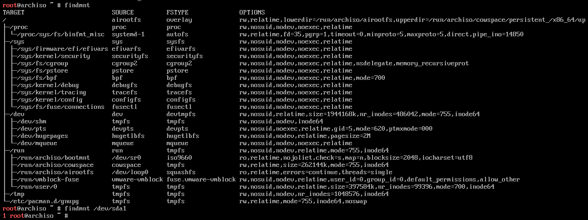

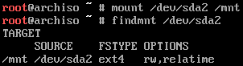

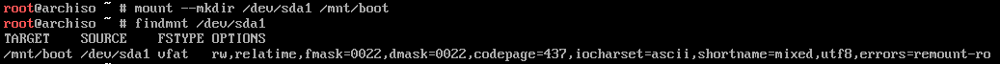


# Installation

### 2.1 Select the mirrors

```
# ls /etc

# ls /etc/pacman.d

# cat /etc/pacman.d/mirrorlist

# pacman -Syyu

```
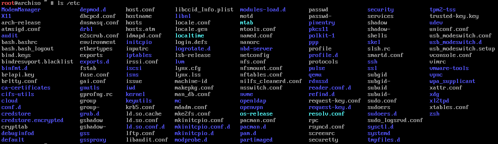

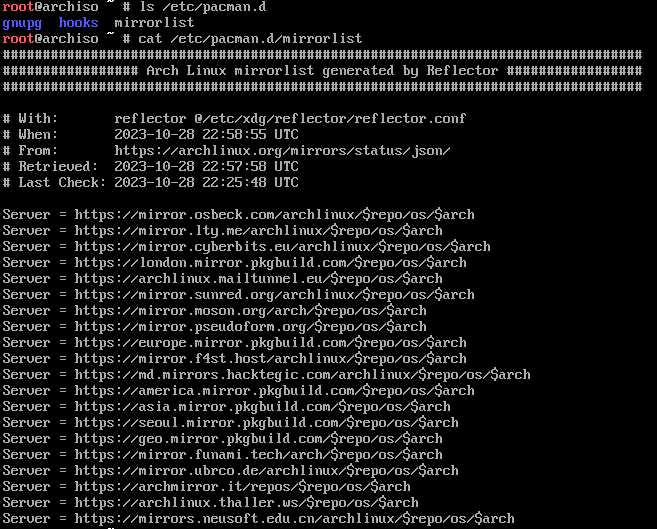


I can try the sweedish mirror.

### 2.2 Install essential packages

```
# pacstrap -K /mnt base linux linux-firmware

```

Optionals
```

e2fsprogs exfatprogs
mdadm lmv2
networkmanager modemmanager usb_modeswitch sof-firmware linux-firmware-marvell 
nano
man-db man-pages texinfo
diffutils sysfsutils
grub efibootmgr
```


I am not a perfect typer

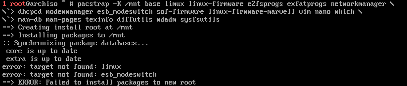

Tried again. Good enough... I'm sure it'll work... soon.

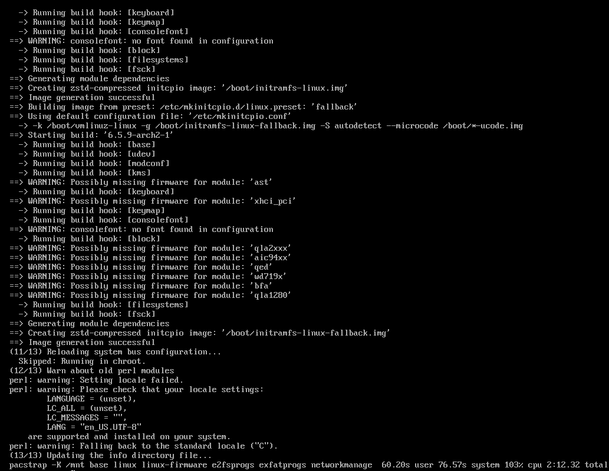

### Configure the system


### 3.1 Fstab

```
# genfstab -U /mnt >> /mnt/etc/fstab

```


### 3.2 Chroot

```
# arch-chroot /mnt

```
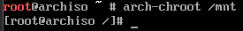

### 3.3 Time zone

```

# ln -sf /usr/share/zoneinfo/US/Central /etc/localtime

# hwclock --systohc

```


### 3.4 Localization

Edit /etc/locale.gen and uncomment en_US.UTF-8 UTF-8 and other needed UTF-8 locales. Generate the locales by running:

```

# nano /etc/local/gen

# locale-gen

# nano /etc/locale.conf

LANG=en_US.UTF-8
```

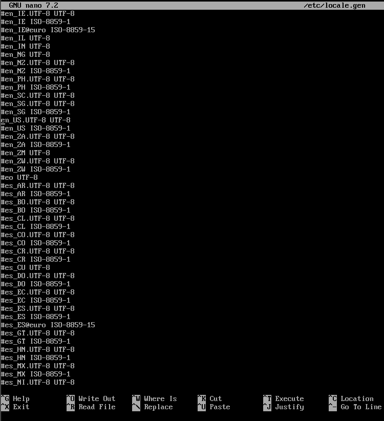

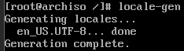

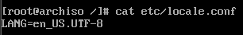

### 3.5 Network configuration

create file
/etc/hostname
```
# nano /etc/hostname
	MyArchLinuxHostThing

$ ip address show

# ip address add address/prefix_len broadcast + dev interface

```

Thought I would have to do these below, but they did not work.
```

# systemctl start NetworkManager.service

$ nmcli device wifi list

$ nmcli device wifi connect SSID_or_BSSID password password

$ nmcli device

$ nmcli connection


```

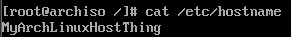


### 3.6 Initramfs

Not required, but if LVM, system encryption or RAID, modify mkinitcpio.conf(5) and recreate the initramfs image:

```
# mkinitcpio -P

```
I skipped.

### 3.7 Root password

```
# passwd

```

I changed the password

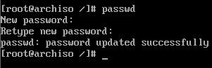


### 3.8 Boot loader

I chose grub, the matrix showed it was the most green.

First, install the packages grub and efibootmgr: GRUB is the boot loader while efibootmgr is used by the GRUB installation script to write boot entries to NVRAM.

Then follow the below steps to install GRUB to your disk:

Mount the EFI system partition and in the remainder of this section, substitute esp with its mount point.
Choose a boot loader identifier, here named GRUB. A directory of that name will be created in esp/EFI/ to store the EFI binary and this is the name that will appear in the UEFI boot menu to identify the GRUB boot entry.
Execute the following command to install the GRUB EFI application grubx64.efi to esp/EFI/GRUB/ and install its modules to /boot/grub/x86_64-efi/.


```
# pacman -S grub efibootmgr

```
That command failed. Not sure why.

```
# pacman -U grub efibootmgr

```
Nope.


The command below is provided by the wiki:

\# grub-install --target=x86_64-efi --efi-directory=esp --bootloader-id=GRUB

esp = mount point

```

# findmnt

esp = /boot

# grub-install --target=x86_64-efi --efi-directory=/boot --bootloader-id=GRUB

# grub-mkconfig -o /boot/grub/grub.cfg


```


Tried
```
update-ca-trust
```


FIXED
```
pacman-key --init
pacman-key --populate archlinux
```


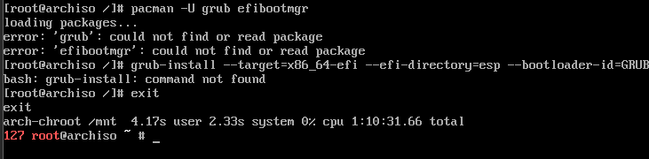

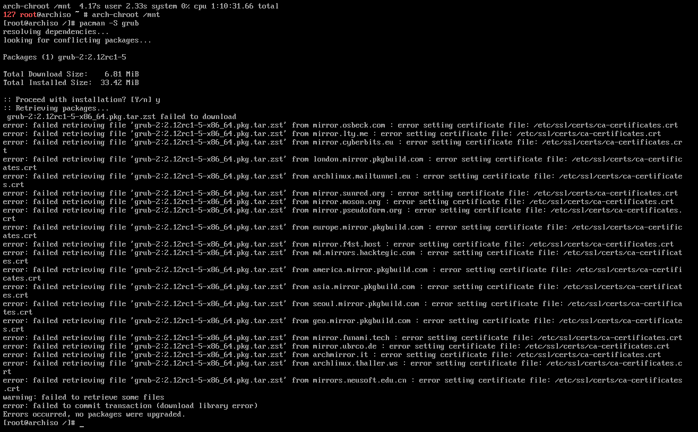

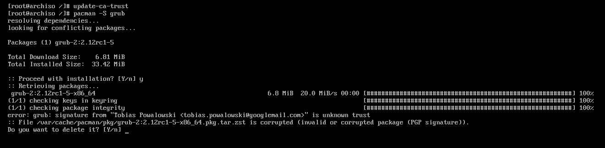

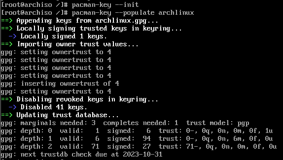

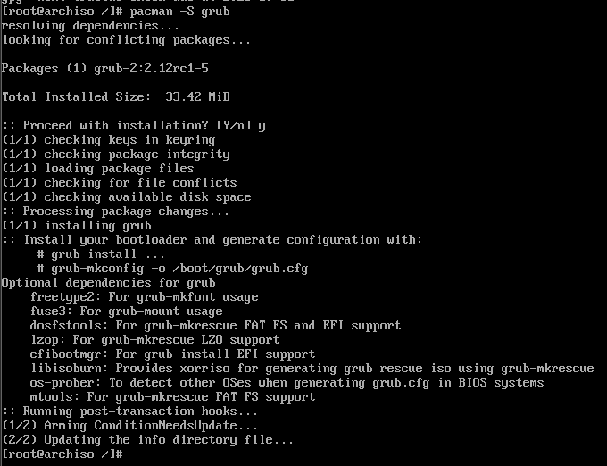

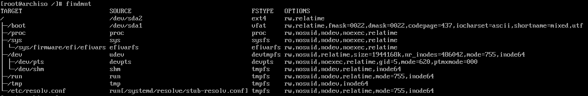

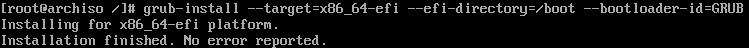

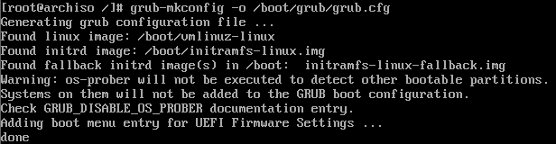


That was frustrating.

### Reboot

```
# umount -R /mnt

# reboot

```

# Post-installation

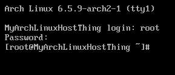

I believe it was successful.


### Adding users

```
# useradd -m ian

# passwd ian

```


```
# useradd -m codi

# passwd codi

GraceHopper1906

```
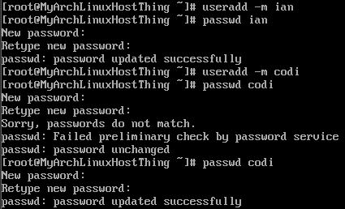


Also edit the /etc/sudoers file, to give sudo group sudo permissions, by uncommenting the sudoers group permissions.

```
# visudo

pacman -S vi
```
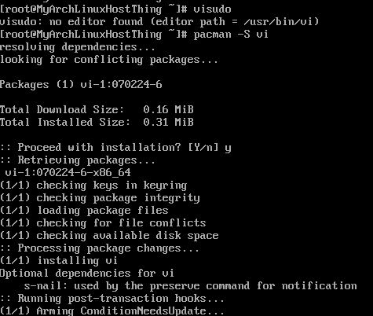


ummmm... i dont like vi. for some reason i could not get the commands to pop up, so i had to restart vm.

```
# EDITOR=/usr/bin/nano visudo
```

```
# groupadd sudo

# usermod -aG sudo ian

# usermod -aG sudo codi

```
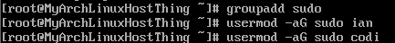
```
pacman -S budgie-desktop

```

Didn't work

I started NetworkManager

```
systemctl start NetworkManager.service

```
Now to figure out how to get that running on boot.


## Grpihcal desktop environment and Display manager

```
pacman -S budgie-desktop

pacman -S gdm

pacman -S xorg-xinit
```
modify ~/.xinitrc

```
$ cp /etc/X11/xinit/xinitrc ~/.xinitrc

nano ~/.xinitrc
```
export XDG_CURRENT_DESKTOP=Budgie:GNOME
exec budgie-desktop

```
systemctl start gdm.service
```


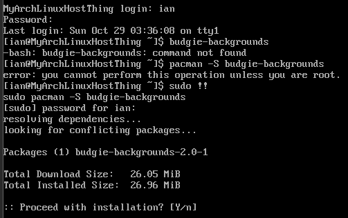

```
	
lspci | grep -e VGA

sudo pacman -Syyu


sudo pacman -S nvidia nvidia-utils nvidia-settings
```


```
sudo pacman -S xorg xterm xorg-xinit

startx
```


```
sudo pacman -S gdm
sudo systemctl enable gdm
sudo systemctl start gdm
```
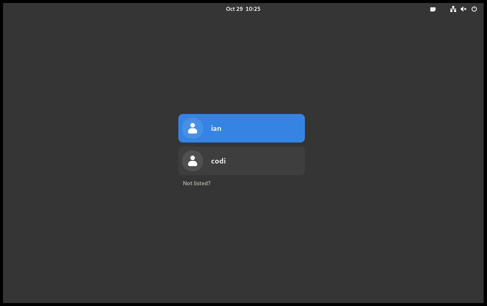


wrote the extractgst script for budgie.
```
echo $PATH

export PATH=$PATH:/bin/sh (appending)

```

had to ./ before file

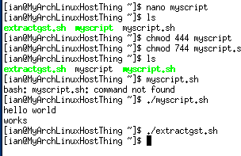

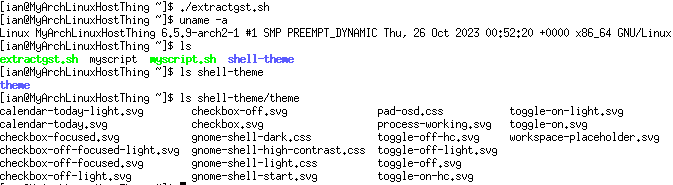


```
sudo pacman -S xorg-xrdb

xrdb ~/.Xresources

xrdb -merge ~/.Xresources

```
Not sure what I did but now I have no cursor, ok now its back.

I am going to try to load into budgie-desktop.


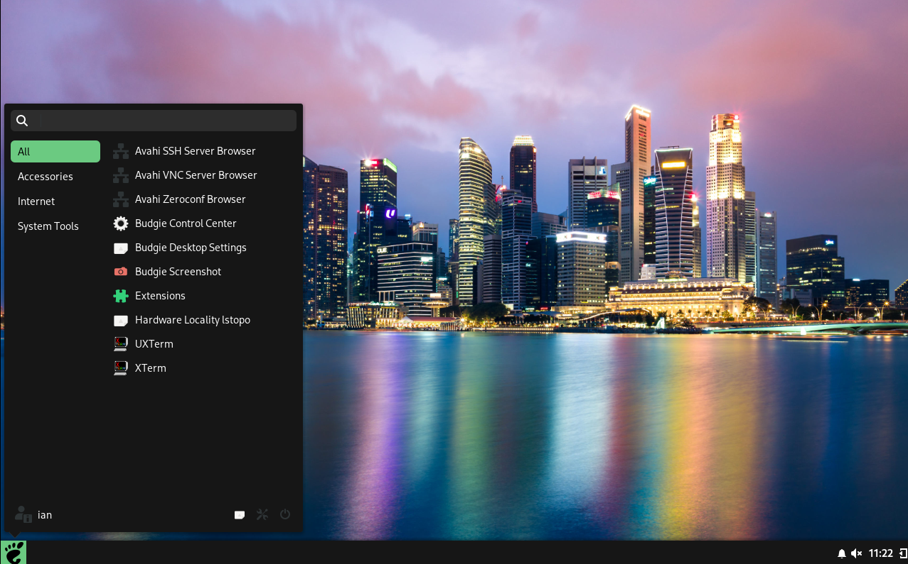

I am going to install Alacritty.

```
sudo pacman -S alacritty
```

I am going to install choromium as a browser.

trying enable for NetworkManger, see if it will start on boot?
```
sudo systemctl enable NetworkManager.service
sudo systemctl start NetworkManager.service
```

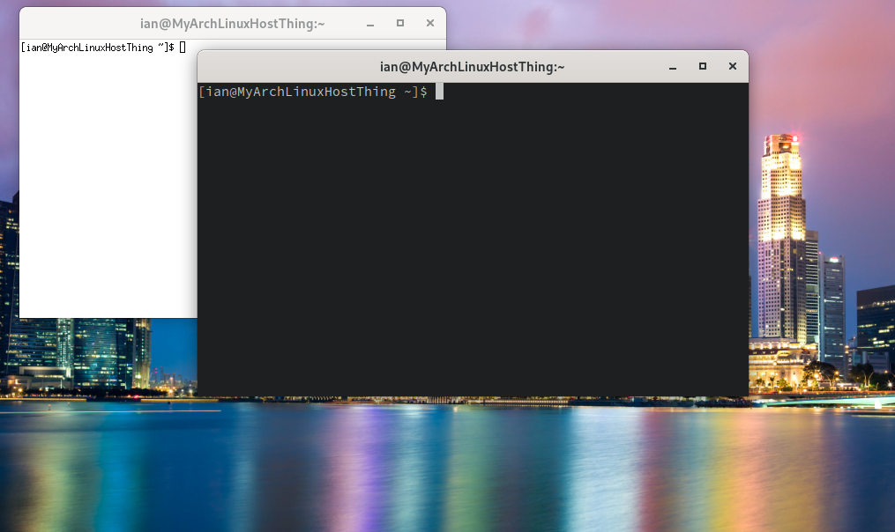

omni color scheme

```
mkdir -p ~/.config/alacritty/themes
git clone https://github.com/alacritty/alacritty-theme ~/.config/alacritty/themes

cp /usr/share/doc/alacritty/example/alacritty.yml $HOME/.alacritty.yml


```

```
nano ~/.alacritty.yml

import:
 - ~/.config/alacritty/themes/themes/omni.yaml
```
I tried omni and baitong.

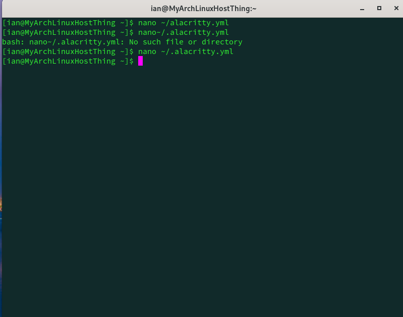

now cyber_punk_neon, a bit better me thinks.


```
sudo pacman -S elinks

sudo pacman -S chromium

```


chromium works, not sure where elinks even is.

In the terminal?

```
elinks --help

elinks google.com
```


aint that something.


I am not very good at operating this thing, I think I broke it.


```
kill 3216

top
k
1829
```


```
$ echo $SHELL

sudo pacman -S fish

sudo pacman -S zsh
```


error??

### configuration of shells

```
git clone --recursive https://github.com/sorin-ionescu/prezto.git "${ZDOTDIR:-$HOME}/.zprezto"

setopt EXTENDED_GLOB
for rcfile in "${ZDOTDIR:-$HOME}"/.zprezto/runcoms/^README.md(.N); do
  ln -s "$rcfile" "${ZDOTDIR:-$HOME}/.${rcfile:t}"
done
```
well that didn't really work... ill try oh_my_zsh.
Connection was refused.
```
sudo pacman -S curl

sh -c "$(curl -fsSL https://raw.githubusercontent.com/ohmyzsh/ohmyzsh/master/tools/install.sh)"

```
I give up, bash xterm is good enought for me.

I did not change my default to fish, ignore block below.
```
 echo /usr/local/bin/fish | sudo tee -a /etc/shells

 chsh -s /usr/local/bin/fish

```

### Alias


```
alias netman='sudo systemctl start NetworkManager.service'

alias spac='sudo pacman -S'

alias c='clear'
```


I don't think that alias worked. I switched terminals which I think made them not carry over. I think it just erases every time it closes. Probably have to edit some config file.

Color coding XTerminal. The Alacritty was interesting, but it was not updating as I would like it to. I had to click it to show the option for y/n when installing packages.

Xterm is also laggy, clear does not always "clear".

none of the below works yet, not sure why.
```
sudo pacman -S xorg-xrdb

$ xrdb ~/.Xresources

$ xrdb -merge ~/.Xresources


XTerm.vt100.foreground: rgb:66/ff/ff
XTerm.vt100.background: rgb:00/00/33
XTerm.vt100.color0: rgb:00/00/cc
XTerm.vt100.color1: rgb:00/00/ff
XTerm.vt100.color2: rgb:00/ff/00
XTerm.vt100.color3: rgb:33/99/ff
XTerm.vt100.color4: rgb:00/99/00
XTerm.vt100.color5: rgb:00/cc/66
XTerm.vt100.color6: rgb:66/b2/ff
XTerm.vt100.color7: rgb:b2/66/ff
XTerm.vt100.color8: rgb:66/ff/ff
XTerm.vt100.color9: rgb:00/99/4c
XTerm.vt100.color10: rgb:99/ff/cc
XTerm.vt100.color11: rgb:00/cc/66
XTerm.vt100.color12: rgb:99/ff/99
XTerm.vt100.color13: rgb:00/cc/cc
XTerm.vt100.color14: rgb:00/cc/00
XTerm.vt100.color15: rgb:99/00/99

XTerm.vt100.selectToClipboard
```


```
sudo pacman -S xorg-xinit

cp /etc/skel/.xinitrc ~/
```


```
xrdb -query

```


still not working...moving on.


I will just create the file, not from the skeleton that apparently does not exit? add in syntax from above.
```
nano ~/.Xresources
```


hmmm...ok. 

```
xterm
```
aha...hmmm. I may have overwritten some things.


alright. good enought.

```
sudo pacman -S openvpn
sudo pacman -S putty
sudo pacman -S openssh
```
Alright, its downloaded, but I clearly have access to the internet and I am pretty sure I don't actually have to ssh.


```
sudo pacman -S spotify-launcher
```


well that works.

Im not sure if that boarder buffer for the desktop environment is supposed to be there? Maybe a product of the VMWare or I was supposed to change that somehow.