# Docker Project

#### Install

```
sudo apt update
sudo apt install docker.io
```
```
sudo service docker status
```
If not already active, then start docker with

```
sudo service docker start
```

What follows is something that might have to be done?
```
sudo apt update
sudo apt install docker-compose-plugin
```
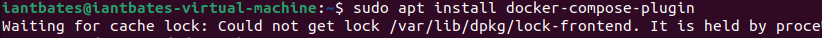

It failed, just moving on, for now.
*it failing had no effect.

## Adventure #1
### Install OpenVAS/Greenbone vulnerability scanner via Docker

https://github.com/mikesplain/openvas-docker

#I followed the video guide, which uses this github to download a container for openvas. 

This github page contains lists of commands and references for docker containization.

```
sudo docker run -d -p 443:443 --name openvas mikesplain/openvas
```
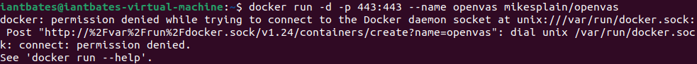

Run with sudo.

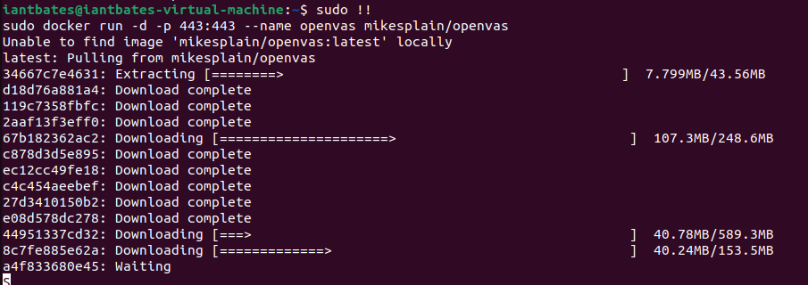

Then wait.

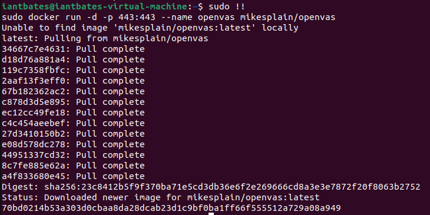

Then check your CPU usage for complete download of signatures.

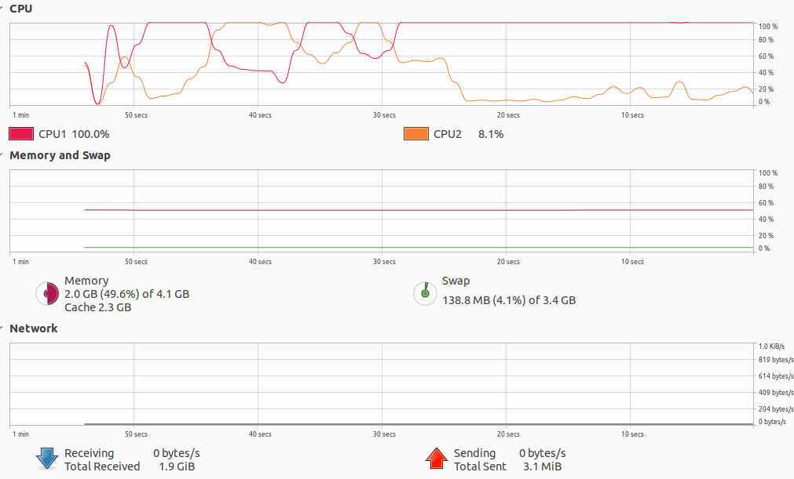

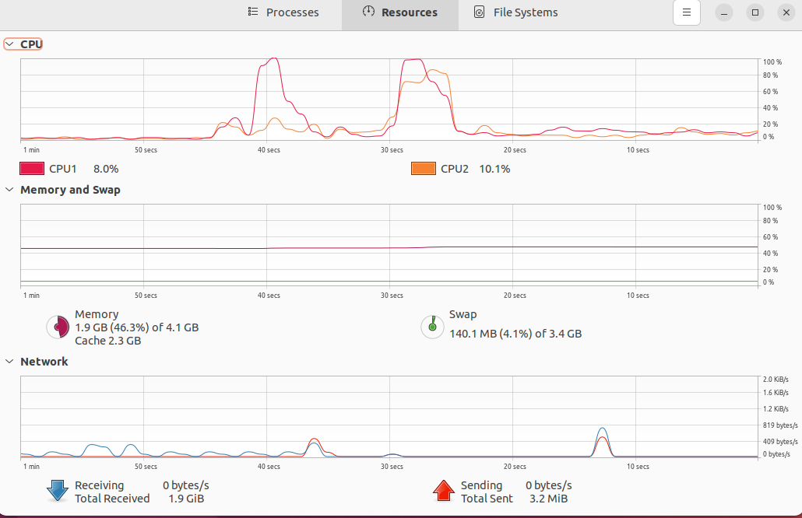

The CPUs have settled down.

I may need to add more RAM to the VM later.

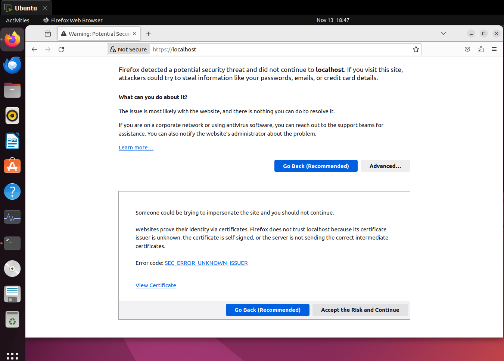

Accept the risk and continue.

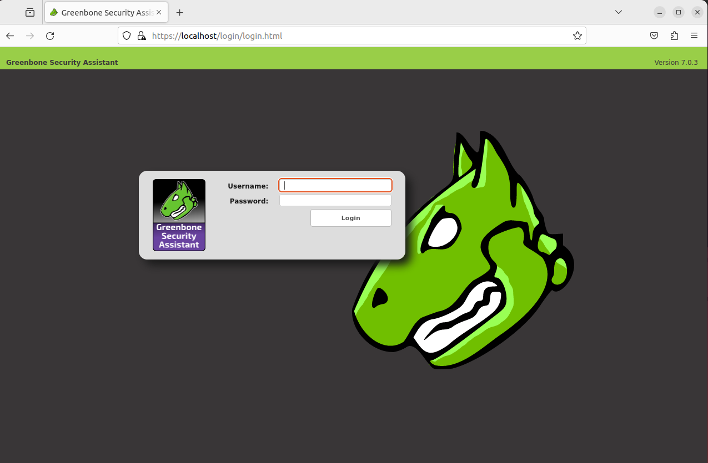

Log in using "admin" for both username and password. 

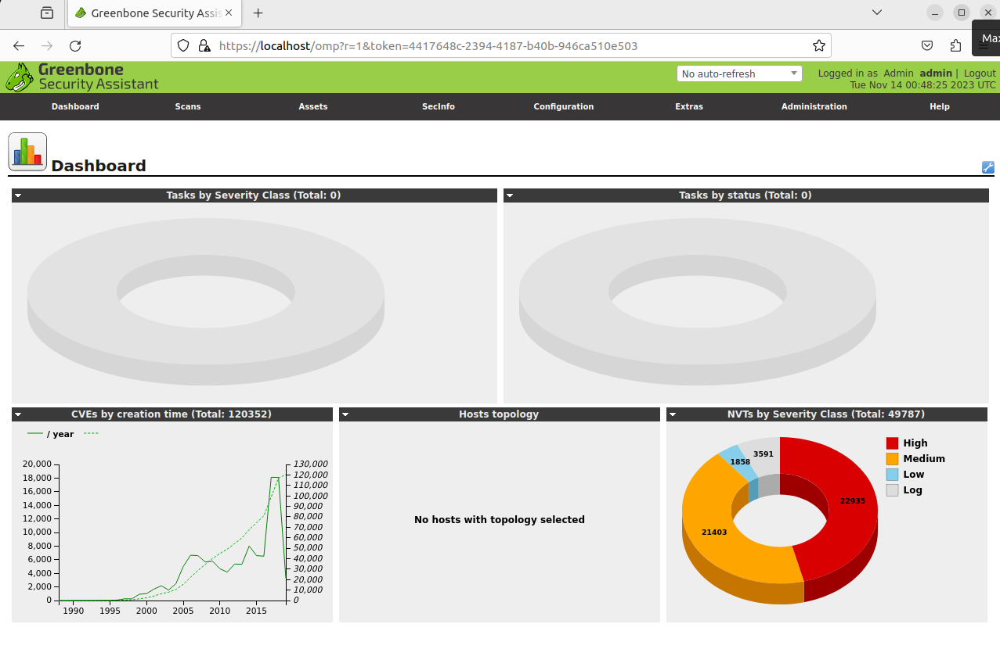

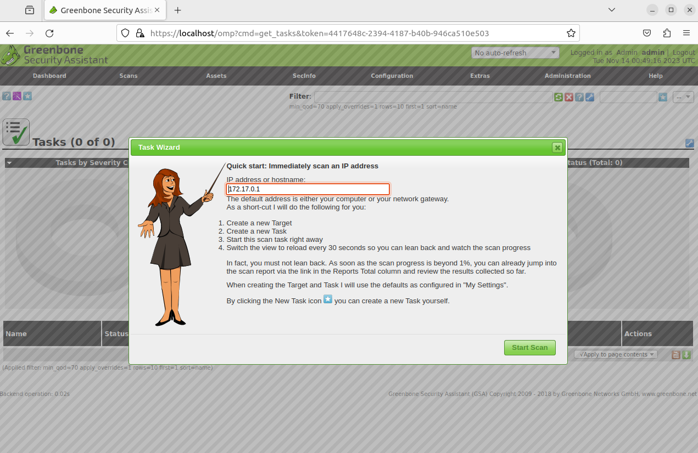

I used the wizard, default.

Oh boy is it slow.

Definitely assigning more ram and CPUs.

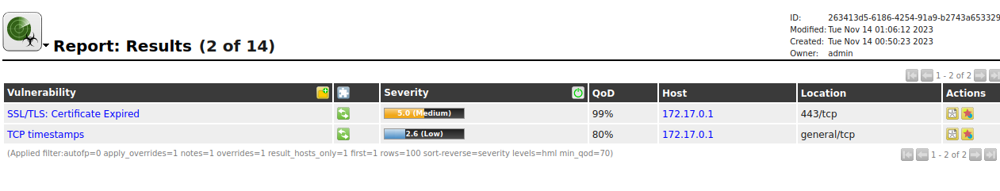

The results of the scan show 2 issues.

I am now going to scan my own defualt gateway.

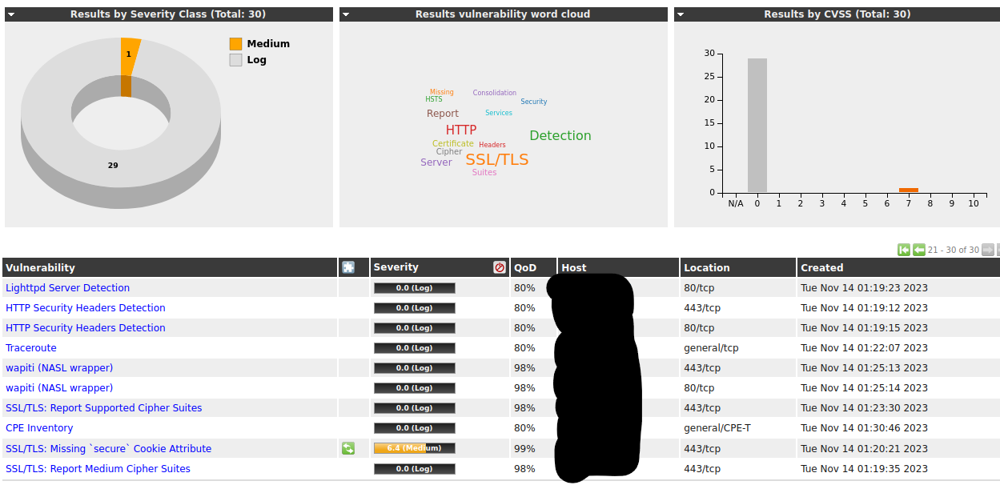

So, my home network is missing the 'secure' Cookie attribute.

# Thats all