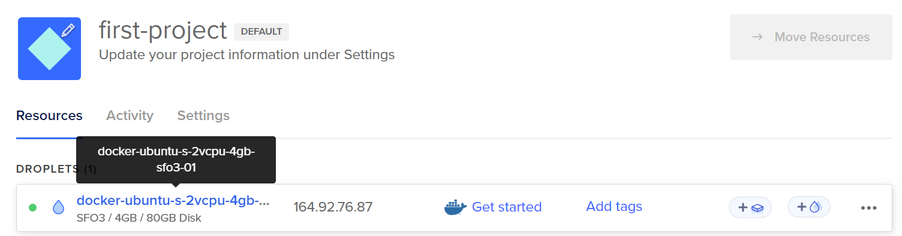
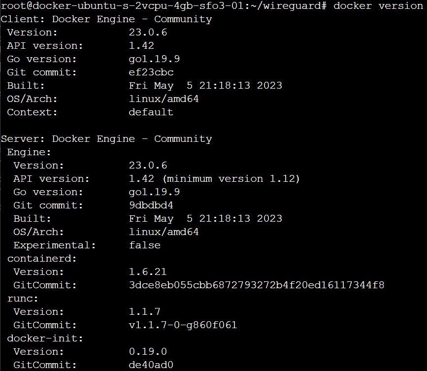

# WireGuard
A VPN using docker.


## Create Digital Ocean Droplet, with Docker Image

The docker image can be found in the marketplace.

The droplet should look like this.



## Launch the Droplet and install Docker Compose

To lauch, click the three dots and then click access console. Then Lauch.

The console should look like this, with Docker and Docker-compose already installed.


## Setup Wireguard
Using the guide at https://thematrix.dev/setup-wireguard-vpn-server-with-docker/ fun these commands:

```
mkdir -p ~/wireguard/
mkdir -p ~/wireguard/config/
nano ~/wireguard/docker-compose.yml
```
Copypaste the below -
```
version: '3.8'
services:
  wireguard:
    container_name: wireguard
    image: linuxserver/wireguard
    environment:
      - PUID=1000
      - PGID=1000
      - TZ=America/Pheonix
      - SERVERURL=164.92.76.87
      - SERVERPORT=51820
      - PEERS=pc1,pc2,phone1
      - PEERDNS=auto
      - INTERNAL_SUBNET=10.0.0.0
    ports:
      - 51820:51820/udp
    volumes:
      - type: bind
        source: ./config/
        target: /config/
      - type: bind
        source: /lib/modules
        target: /lib/modules
    restart: always
    cap_add:
      - NET_ADMIN
      - SYS_MODULE
    sysctls:
      - net.ipv4.conf.all.src_valid_mark=1
```

### Options Modifications of the above
Timezone (TZ) = Your timezone
* List for TZ can be found at https://en.wikipedia.org/wiki/List_of_tz_database_time_zones?ref=thematrix.dev

IP Address (SERVERURL) = The IP listed on the Dashboard

Setup Configs (PEERS) = names of peers.

### Start Wireguard

``` 
cd ~/wireguard/
docker-compose up -d
```
...So, slight issue. Return to this step afte completing the next one.





### Download Docker-Compose (the Terminal Lied?)

Run command:
```
sudo curl -L "https://github.com/docker/compose/releases/download/1.27.4/docker-compose-$(uname -s)-$(uname -m)" -o /usr/local/bin/docker-compose
```


Then change permissions:
```
sudo chmod +x /usr/local/bin/docker-compose
```
Try to run docker-compose in previous section again.


### Connect to device
Run:
```
docker-compose logs -f wireguard
```
This will give the QR code for the phone.

#### Phone

For phone, download app, then use QR Code (peer=phone1).


Before:

After:


#### Computer
Install Wireguard. Download config file for peer=pc1. I would recommend using WinSCP.


Before:

After:


